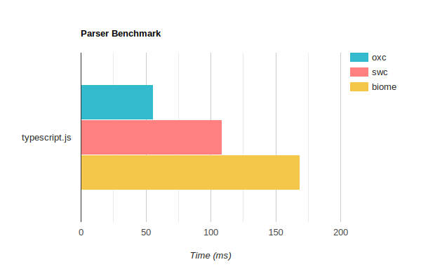

# Parser Benchmark for Oxc, Swc and Biome

The purpose of this benchmark is for people who wants to evaluate and compare the performance characteristics of these parsers.

The numbers indicate that Oxc is at least 3 times faster than Swc and 5 times faster than Biome.

## CPU

### Codspeed Measurement

[![CodSpeed Badge][codspeed-badge]][codspeed-url]

[codspeed-badge]: https://img.shields.io/endpoint?url=https://codspeed.io/badge.json
[codspeed-url]: https://codspeed.io/oxc-project/bench-javascript-parser-written-in-rust/benchmarks

Codspeed measures performance by cpu instructions.

### Mac i7 6 cores



### Mac mini M2 8 cores

#### cal.com.tsx

|               | oxc              | swc               | biome             |
| ------------- | ---------------- | ----------------- | ----------------- |
| no-drop       | `4.0 ms` (1.00x) | `14.0 ms` (3.50x) | `18.7 ms` (4.68x) |
| parallel      | `7.4 ms` (1.00x) | `26.4 ms` (3.56x) | `38.7 ms` (5.21x) |
| single-thread | `4.0 ms` (1.00x) | `14.9 ms` (3.73x) | `20.1 ms` (5.04x) |

### typescript.js

|               | oxc               | swc                | biome              |
| ------------- | ----------------- | ------------------ | ------------------ |
| no-drop       | `30.3 ms` (1.00x) | `100.3 ms` (3.31x) | `149.7 ms` (4.94x) |
| parallel      | `52.0 ms` (1.00x) | `164.5 ms` (3.17x) | `296.5 ms` (5.71x) |
| single-thread | `29.8 ms` (1.00x) | `108.0 ms` (3.62x) | `159.5 ms` (5.34x) |

### MacBook Pro M3 Max

#### cal.com.tsx

|               | oxc              | swc               | biome             |
| ------------- | ---------------- | ----------------- | ----------------- |
| no-drop       | `3.4 ms` (1.00x) | `13.4 ms` (3.99x) | `16.7 ms` (4.97x) |
| parallel      | `5.8 ms` (1.00x) | `23.8 ms` (4.14x) | `30.1 ms` (5.23x) |
| single-thread | `3.4 ms` (1.00x) | `14.4 ms` (4.28x) | `18.3 ms` (5.42x) |

#### typescript.js

|               | oxc               | swc                | biome              |
| ------------- | ----------------- | ------------------ | ------------------ |
| no-drop       | `26.3 ms` (1.00x) | `84.1 ms` (3.20x)  | `130.1 ms` (4.94x) |
| parallel      | `36.1 ms` (1.00x) | `126.3 ms` (3.50x) | `225.9 ms` (6.26x) |
| single-thread | `26.4 ms` (1.00x) | `91.0 ms` (3.45x)  | `139.3 ms` (5.28x) |

### Run benchmark locally

Run the following command on your machine for replication.

```bash
cargo bench
```

Generate the table

```bash
pnpm i
pnpm run table
```

## Maximum Resident Set Size

```
./memory.sh

./files/cal.com.tsx
oxc   11.5 mb (1.00x)
swc   16.6 mb (1.44x)
biome 22.5 mb (1.95x)

./files/typescript.js
oxc    68.8 mb (1.00x)
swc    92.0 mb (1.34x)
biome 117.4 mb (1.70x)
```

## Setup

* Uses `mimalloc` as the global allocator
* Uses the following release profile

```toml
[profile.release]
opt-level     = 3
lto           = "fat"
codegen-units = 1
strip         = "symbols"
debug         = false
panic         = "abort"
```

### single-thread

This is the standard benchmark run in a single thread.

```rust
group.bench_with_input(id, &source, |b, source| {
    b.iter(|| Self::parse(source))
});
```

### no-drop

This uses the [`iter_with_large_drop`](https://docs.rs/criterion/0.5.1/criterion/struct.Bencher.html#method.iter_with_large_drop) function, which does not take AST drop time into account.
Notice there is only a 0.3ms difference for oxc, but 7ms difference for swc.

AST drop time can become a bottleneck in applications such as as bundler,
where there are a few thousands of files need to be parsed.

```rust
group.bench_with_input(id, &source, |b, source| {
    b.iter_with_large_drop(|| Self::parse(source))
});
```

### parallel

This benchmark uses the total number of physical cores as the total number of files to parse per bench iteration. For example it parses 6 files in parallel on my Mac i7 6 cores.

This can indicate the existence of global resource contention.

```rust
let cpus = num_cpus::get_physical();
group.bench_with_input(id, &source, |b, source| {
    b.iter(|| {
        (0..cpus).into_par_iter().for_each(|_| {
            Self::parse(source);
        });
    })
});
```
