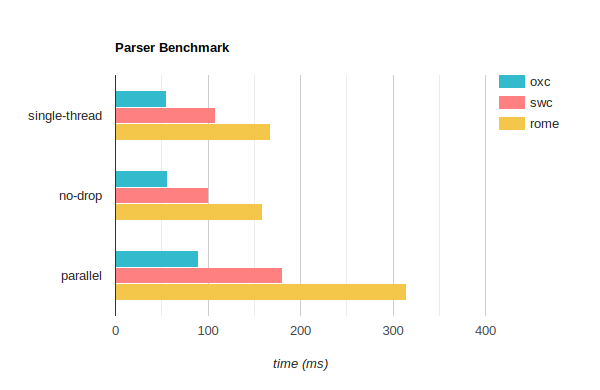

# Benchmark for Oxc, Swc and Rome parser

The purpose of this benchmark is for people who wants to evaluate and compare the performance characteristics of these parsers.

## Results

### Mac M2 8 cores




|                     | `oxc`                    | `swc`                            | `rome`                            |
|:--------------------|:-------------------------|:---------------------------------|:--------------------------------- |
| **`single-thread`** | `55.86 ms` (**1.00x**)   | `108.68 ms` (*1.95x slower*)     | `168.88 ms` (*3.02x slower*)      |
| **`no-drop`**       | `56.17 ms` (**1.00x**)   | `101.47 ms` (*1.81x slower*)     | `159.46 ms` (*2.84x slower*)      |
| **`parallel`**      | `90.12 ms` (**1.00x**)   | `180.26 ms` (*2.00x slower*)     | `315.39 ms` (*3.50x slower*)      |

#### single-thread

This is the standard benchmark run in a single thread.

```rust
group.bench_with_input(id, &source, |b, source| {
    b.iter(|| Self::parse(source))
});
```

#### no-drop

This uses the [`iter_with_large_drop`](https://docs.rs/criterion/0.5.1/criterion/struct.Bencher.html#method.iter_with_large_drop) function, which does not take AST drop time into account.
Notice there is only a 0.3ms difference for oxc, but 7ms difference for swc.

AST drop time can become a bottleneck in applications such as as bundler,
where there are a few thousands of files need to be parsed.

```rust
group.bench_with_input(id, &source, |b, source| {
    b.iter_with_large_drop(|| Self::parse(source))
});
```

#### parallel

This benchmark uses the total number of physical cores as the total number of files to parse per bench iteration. For example it parses 6 files in parallel on my Mac i7 6 cores.

This can indicate the existence of resource contention.
For example swc uses [`string_cache`](https://crates.io/crates/string_cache) crate, which uses a global concurrent hashmap.

```rust
let cpus = num_cpus::get_physical();
group.bench_with_input(id, &source, |b, source| {
    b.iter(|| {
        (0..cpus).into_par_iter().for_each(|_| {
            Self::parse(source);
        });
    })
});
```

## Run

Run the following command on your machine for replication.

```bash
cargo bench
```

To generate the table

```bash
cargo install cargo-criterion
cargo install criterion-table
cargo criterion --message-format=json | criterion-table > BENCHMARKS.md
```

## Input

* File: https://cdn.jsdelivr.net/npm/typescript@5.1.6/lib/typescript.js
* File Size: 7.8M
* Uses `mimalloc` as the global allocator
* Uses the following release profile

```toml
[profile.release]
opt-level     = 3
lto           = "fat"
codegen-units = 1
strip         = "symbols"
debug         = false
panic         = "abort"
```
